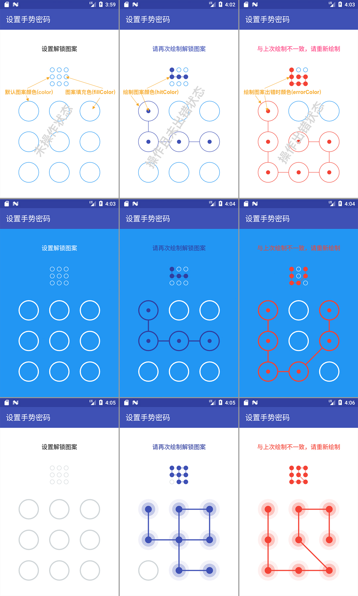

##  Pattern Locker

此为Android App中常用控件之一的图案解锁（手势解锁、手势密码、九宫格密码、九宫格图形锁等）控件开源库，PatternLockerView为主控件，负责图案密码的设置和验证，PatternIndicatorView为指示器辅助控件，可根据设计需要选择使用。

由于本人水平有限，如果您在使用的过程中发现bug，或者发现有更好的实现方式和代码中写得不足的地方，请提issue或者PR，本人万分感激！！！

## 功能介绍
- 支持自定义各状态下（未操作时、操作时以及操作出错时）线颜色、填充色和线宽；
- 支持自定义各种状态下（未操作时、操作时以及操作出错时）每个CellView样式和连接线样式；
- 支持设置图案绘制完成后延迟自动清除的时长（默认1秒）；
- 支持是否跳过中间点（默认不跳过）；
- 支持是否触碰震动反馈（默认不震动）；
- 支持指示器辅助控件可选择使用；
- 业务逻辑（至少连点几个点、验证时最多可出错几次等）须自定义。

## 预览效果图


[点击下载PatternLockerDemo.apk](https://fir.im/qvhx) 或者扫描下方二维码下载安装   


## 自由定制

### 1. 默认样式简单定制   
可以通过xml和kotlin代码两种方式更改默认颜色、绘制时颜色、出错时颜色、填充色以及连接线粗细等

> 推荐使用xml方式，更精简，更方便

#### 1.1 xml方式
- PatternLockerView可设置的属性

| 属性名            | 说明         | 默认值     |
| :------------- | :--------: | :-----: |
| plv_color      | 默认图案的颜色    | #2196F3 |
| plv_hitColor   | 绘制图案的颜色    | #3F51B5 |
| plv_errorColor | 绘制图案出错时的颜色 | #F44336 |
| plv_fillColor  | 图案填充色      | #FFFFFF |
| plv_lineWidth  | 图案的线宽      | 1dp     |
| plv_enableAutoClean  | 自动清除绘制图案      | true     |
| plv_enableSkip        |    是否跳过中间点    |  false  |
| plv_enableHapticFeedback | 是否使用触碰震动反馈 |  false  |
| plv_freezeDuration | 操作完延迟自动清除时长（单位ms） | 1000 |


示例如下：
```xml
<com.github.ihsg.patternlocker.PatternLockerView
        android:id="@+id/patternLockerView"
        android:layout_width="match_parent"
        android:layout_height="match_parent"
        android:layout_marginLeft="50dp"
        android:layout_marginTop="20dp"
        android:layout_marginRight="50dp"
        app:plv_enableSkip="true"
        app:plv_color="@color/color_gray"
        app:plv_enableAutoClean="false"
        app:plv_errorColor="@color/color_red"
        app:plv_fillColor="@color/colorWhite"
        app:plv_hitColor="@color/colorPrimary"
        app:plv_freezeDuration="5000"
        app:plv_lineWidth="3dp" />
```

- PatternIndicatorView可设置的属性

| 属性名            | 说明             | 默认值     |
| :------------- | :------------- | :------ |
| piv_color      | 指示器默认图案的颜色     | #2196F3 |
| piv_hitColor   | 指示器中选中图案的颜色    | #3F51B5 |
| piv_errorColor | 指示器中选中图案出错时的颜色 | #F44336 |
| piv_fillColor  | 图案填充色          | #FFFFFF |
| piv_lineWidth  | 图案的线宽       | 1dp     |

示例如下：
```xml
<com.github.ihsg.patternlocker.PatternLockerView
        android:id="@+id/patternLockerView"
        android:layout_width="match_parent"
        android:layout_height="match_parent"
        android:layout_marginLeft="50dp"
        android:layout_marginTop="20dp"
        android:layout_marginRight="50dp"
        app:plv_enableSkip="true"
        app:plv_enableHapticFeedback="true"
        app:plv_color="@color/color_gray"
        app:plv_enableAutoClean="false"
        app:plv_errorColor="@color/color_red"
        app:plv_fillColor="@color/colorWhite"
        app:plv_hitColor="@color/colorPrimary"
        app:plv_lineWidth="3dp" />
```
#### 1.2 kotlin代码方式

> 这里styleDecorator可以通过normalCellView、hitCellView和linkedLineView三者均可获取，下面以normalCellView为例。

- PatternLockerView可设置的属性
````kotlin
val plvStyle = (this.patternLockerView.normalCellView as DefaultLockerNormalCellView).styleDecorator

plvStyle.normalColor = ContextCompat.getColor(this, R.color.colorWhite)
plvStyle.fillColor = ContextCompat.getColor(this, R.color.color_blue)
plvStyle.hitColor = ContextCompat.getColor(this, R.color.colorPrimaryDark)
plvStyle.errorColor = ContextCompat.getColor(this, R.color.color_red)
plvStyle.lineWidth = TypedValue.applyDimension(TypedValue.COMPLEX_UNIT_DIP, 5f,
                resources.displayMetrics)
````

- PatternIndicatorView可设置的属性
````kotlin
val pivStyle = (this.patternIndicatorView.normalCellView as DefaultLockerNormalCellView).styleDecorator
        
pivStyle.normalColor = ContextCompat.getColor(this, R.color.colorWhite)
pivStyle.fillColor = ContextCompat.getColor(this, R.color.color_blue)
pivStyle.hitColor = ContextCompat.getColor(this, R.color.colorPrimaryDark)
pivStyle.errorColor = ContextCompat.getColor(this, R.color.color_red)
pivStyle.lineWidth = TypedValue.applyDimension(TypedValue.COMPLEX_UNIT_DIP, 2f,
                resources.displayMetrics)
````

### 2. 深度定制

PatternLockerView和PatternIndicatorView均提供了设置连接线、各个小单元控件在不同状态下（正常、设置以及出错）的绘制方式的方法，只需要实现如下几个接口即可，从而可以根据设计需求高度自由定制。

- 正常状态下各个小单元控件的样式（PatternLockerView和PatternIndicatorView通用）

```kotlin
interface INormalCellView {
    /**
     * 绘制正常情况下（即未设置的）每个图案的样式
     *
     * @param canvas
     * @param cellBean the target cell view
     */
    fun draw(canvas: Canvas, cellBean: CellBean)
}
```

- 设置时各个小单元控件的样式（PatternLockerView和PatternIndicatorView通用）

```kotlin
interface IHitCellView {
    /**
     * 绘制已设置的每个图案的样式
     *
     * @param canvas
     * @param cellBean
     * @param isError
     */
    fun draw(canvas: Canvas, cellBean: CellBean, isError: Boolean)
}
```

- PatternLockerView连接线的样式

```kotlin
interface ILockerLinkedLineView {
    /**
     * 绘制图案密码连接线
     *
     * @param canvas
     * @param hitIndexList
     * @param cellBeanList
     * @param endX
     * @param endY
     * @param isError
     */
    fun draw(canvas: Canvas,
             hitIndexList: List<Int>,
             cellBeanList: List<CellBean>,
             endX: Float,
             endY: Float,
             isError: Boolean)
}
```

- PatternIndicatorView连接线的样式

```kotlin
interface IIndicatorLinkedLineView {
    /**
     * 绘制指示器连接线
     *
     * @param canvas
     * @param hitIndexList
     * @param cellBeanList
     * @param isError
     */
    fun draw(canvas: Canvas,
             hitIndexList: List<Int>,
             cellBeanList: List<CellBean>,
             isError: Boolean)
}
```

分别设置主控件和指示器的定制实现：

```kotlin
// 主控件
patternLockerView.normalCellView = ... //定制实现
patternLockerView.hitCellView = ... //定制实现
patternLockerView.linkedLineView = ... //定制实现

// 指示器控件
patternIndicatorView.normalCellView = ... //定制实现
patternIndicatorView.hitCellView = ... //定制实现
patternIndicatorView.linkedLineView = ... //定制实现
```

> 温馨提示：更详细的定制方式可参考Library中default开头的代码。

### 联系方式（微信）

当你遇到问题时，请先看demo了解用法，如果还是没有解决又比较着急，可以通过微信联系我哦！


